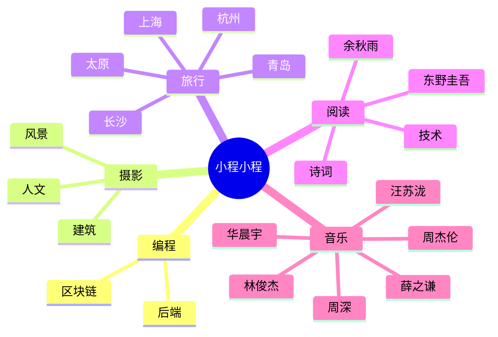

 

  <!-- dynamic typing effect 动态打字效果 -->

  <!-- knock code pictures 敲代码的图片 -->
   

  <!-- Snake Code Contribution Map 贪吃蛇代码贡献图 -->
  

#  🙋 Hello

<table>
<tr><td>

<!-- About me 关于我 -->
### 🤺 About Me
 

&emsp;&emsp;🙋 Hello everyone，this is 小程同学

&emsp;&emsp; 📖 I am a postgraduate student

&emsp;&emsp; 🏠 Shanxi pingyao 

&emsp;&emsp; ✨ 2000 185cm 🏹️ 

&emsp;&emsp;🏀  Prefering all kinds of sports 

&emsp;&emsp;🎤 Please let me sing 《Fridnds》for you 

<strong>&emsp;&emsp;🌞 Forever young, forever in tears</strong>

</td></tr>

<tr>
<td>
  
### 🏢 education Experience

- 太原理工大学（本科） &emsp; 2018-09 —— 2022-06
    
 💻 软件工程

- 上海第二工业大学（硕士） &emsp;  2022-09 —— 2025-07
    
 💻电子信息（密码学、区块链、隐私保护）
  
</td>
</tr>

<tr><td>

    
<!-- ########################################## 分割 ########################################## -->

 

<!-- Wakatime Graph-->
<table>
  <tr>
    <td></td>
    <td></td>
  </tr>
  <tr>
   
  </tr>
</table>

